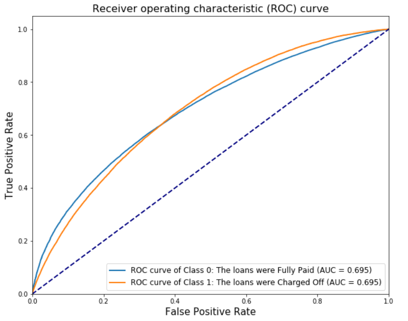

## Data

This dataset contains the full Lending Club data available from their [*site*](https://www.lendingclub.com/info/download-data.action). There are separate files for accepted and rejected loans. The accepted loans also include the FICO scores, which can only be downloaded when you are signed in to Lending Club and download the data. The data used contain all the Loans of the Lending Club during the period 2007 - 2018 consisting of > ~1.5M samples and > 150 features. Our goal in this project was the prediction of whether someone who submits an application for a loan, will be able to Fully Pay the loan or if the loan will be Charged off.

## Model
We trained a 7-layer NN using Keras and since we had a class-imbalance problem, we applied Class Weighting to the posterior probabilities and Early Stopping where we used the F1-score as the evaluation metric in order to pick the best model.

## Results
Even though we built a very simple model, the 7-layer NN was able to **beat the Top Voted kernel in Kaggle** as can be shown here [*Kaggle Top Kernel*](https://www.kaggle.com/pileatedperch/predicting-charge-off-from-initial-listing-data) by using exactly the same data preprocessing techniques. More specifically, the top Kaggle kernel had achieved AUC=0.689 while our model achieved **AUC = 0.695** as can be shown in the following figure:

    
    
Fig. ROC curve of our model.

